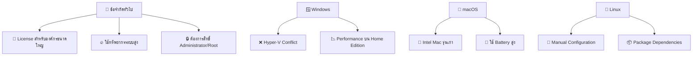
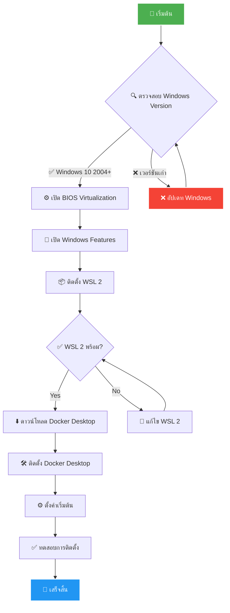
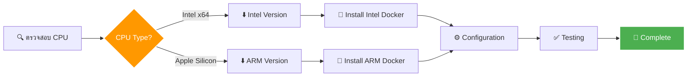
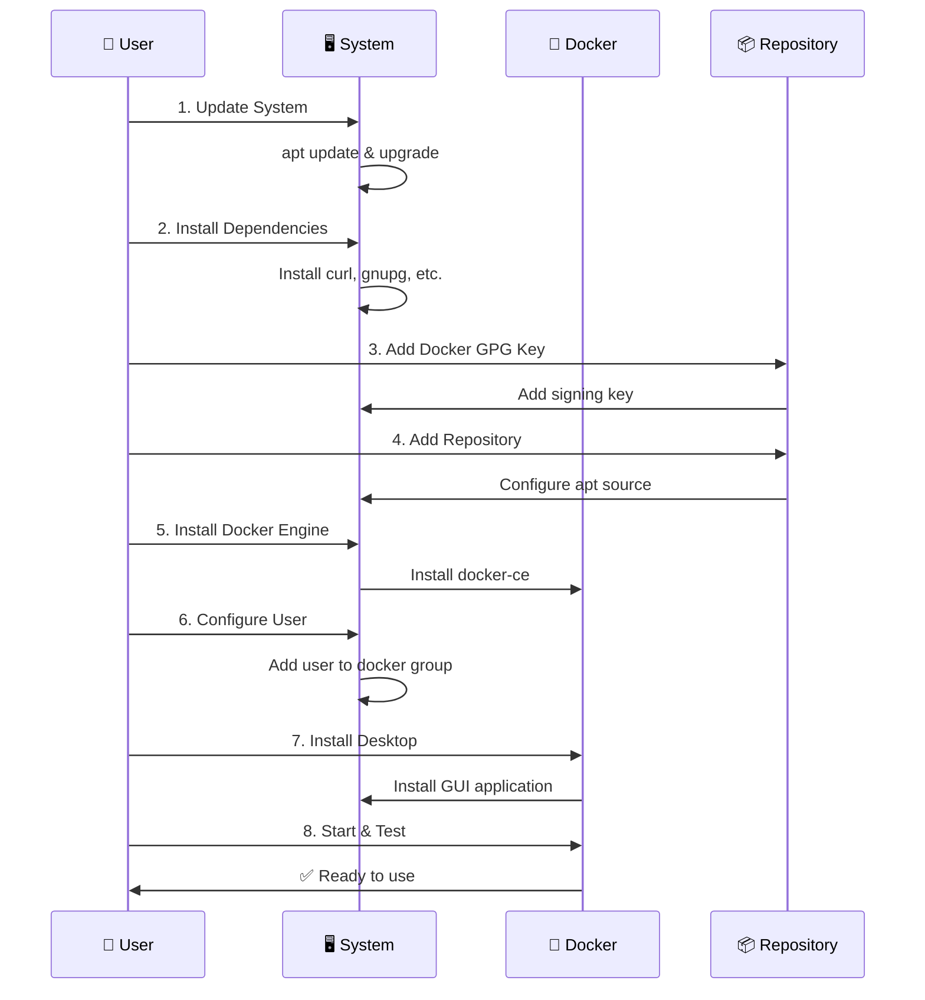
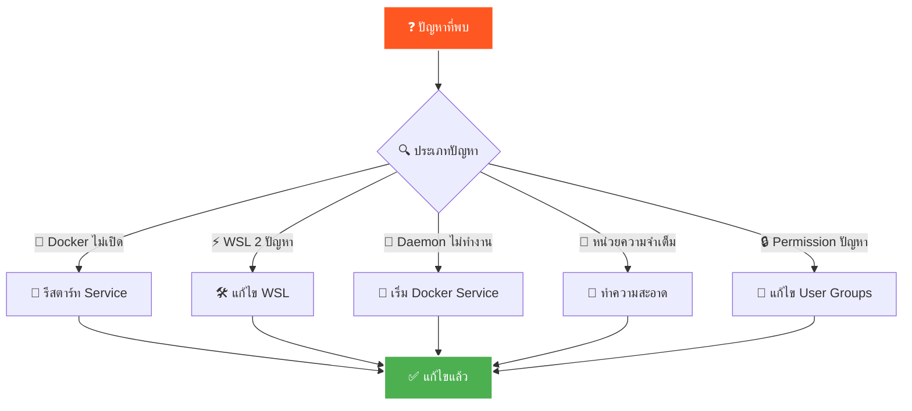

# 🐳 คู่มือการติดตั้ง Docker Desktop แบบสมบูรณ์


## 📺 Video Tutorials

### 🎬 การติดตั้งแบบ Step-by-Step

| 📱 Platform | 🎥 Video Tutorial | 📋 เนื้อหา |
|------------|------------------|----------|
| **Windows** | [🎬 Windows Installation](http://langflow.minddatatech.com:8085/1.mp4) | การติดตั้งบน Windows 10/11 |
| **macOS** | [🎬 macOS Installation](http://langflow.minddatatech.com:8085/2.mp4) | การติดตั้งบน Mac (Intel + Apple Silicon) |
| **Linux** | [🎬 Linux Installation](http://langflow.minddatatech.com:8085/3.mp4) | การติดตั้งบน Ubuntu/Debian |

> 💡 **คำแนะนำ:** ดู video ก่อนเริ่มติดตั้งเพื่อเข้าใจขั้นตอนทั้งหมด

---

## 📋 สารบัญ
- [🔧 ข้อกำหนดระบบขั้นต่ำ](#-ข้อกำหนดระบบขั้นต่ำ)
- [⚠️ ข้อจำกัดและหมายเหตุสำคัญ](#️-ข้อจำกัดและหมายเหตุสำคัญ)
- [🪟 การติดตั้งบน Windows](#-การติดตั้งบน-windows)
- [🍎 การติดตั้งบน macOS](#-การติดตั้งบน-macos)
- [🐧 การติดตั้งบน Linux (Ubuntu)](#-การติดตั้งบน-linux-ubuntu)
- [✅ การทดสอบการติดตั้ง](#-การทดสอบการติดตั้ง)
- [🔍 การแก้ปัญหาเบื้องต้น](#-การแก้ปัญหาเบื้องต้น)
- [💡 เคล็ดลับการใช้งาน](#-เคล็ดลับการใช้งาน)

---

## 🔧 ข้อกำหนดระบบขั้นต่ำ

### 📊 ตารางเปรียบเทียบระบบปฏิบัติการ

| 💻 ระบบปฏิบัติการ | 🧠 CPU | 💾 RAM | 💿 พื้นที่ | 📋 ข้อกำหนดพิเศษ |
|------------------|--------|--------|-----------|-------------------|
| **Windows** | 64-bit + SLAT | 4 GB (แนะนำ 8 GB) | 20 GB | WSL 2, Virtualization |
| **macOS** | Intel 2010+ / Apple Silicon | 4 GB (แนะนำ 8 GB) | 20 GB | macOS Big Sur 11+ |
| **Linux** | 64-bit | 4 GB (แนะนำ 8 GB) | 20 GB | Kernel 3.10+ |

### 🪟 Windows รายละเอียด
- **ระบบปฏิบัติการ:** Windows 10 64-bit (Home, Pro, Enterprise, Education) version 2004+
- **หน่วยความจำ:** 4 GB RAM ขั้นต่ำ (แนะนำ 8 GB+)
- **พื้นที่เก็บข้อมูล:** 20 GB พื้นที่ว่างขั้นต่ำ
- **CPU:** 64-bit processor พร้อม SLAT (Second Level Address Translation)
- **BIOS:** เปิดใช้งาน virtualization (Intel VT-x หรือ AMD-V)
- **WSL 2:** จำเป็นต้องติดตั้ง

### 🍎 macOS รายละเอียด
- **ระบบปฏิบัติการ:** macOS Big Sur 11+
- **หน่วยความจำ:** 4 GB RAM ขั้นต่ำ (แนะนำ 8 GB+)
- **CPU:** 
  - Mac Intel: 2010+ พร้อม Intel's MMU
  - Apple Silicon (M1/M2/M3/M4): รองรับทั้งหมด

### 🐧 Linux (Ubuntu) รายละเอียด
- **ระบบปฏิบัติการ:** Ubuntu 20.04 LTS+
- **หน่วยความจำ:** 4 GB RAM ขั้นต่ำ (แนะนำ 8 GB+)
- **CPU:** 64-bit processor
- **Kernel:** Linux kernel 3.10+

---

## ⚠️ ข้อจำกัดและหมายเหตุสำคัญ



### 📋 ตารางข้อจำกัด

| 🖥️ ระบบ | ⚠️ ข้อจำกัด | 🎯 แนวทางแก้ไข |
|----------|-------------|-----------------|
| **Windows** | Hyper-V Conflict | ใช้ WSL 2 Backend |
| **Windows** | Performance บน Home | อัปเกรดเป็น Pro หรือใช้ VM |
| **macOS Intel** | ความเร็วช้า | พิจารณาอัปเกรดเครื่อง |
| **macOS** | ใช้ Battery สูง | ปิดเมื่อไม่ใช้งาน |
| **Linux** | การตั้งค่าซับซ้อน | ติดตาม Guide อย่างละเอียด |

---

## 🪟 การติดตั้งบน Windows

### 🔄 Flow Chart การติดตั้ง



### 🔧 ขั้นตอนที่ 1: การเปิดใช้งาน Virtualization ใน BIOS

| 🏭 ผู้ผลิต | 🔑 ปุ่มเข้า BIOS | 📍 ตำแหน่งการตั้งค่า |
|----------|-----------------|---------------------|
| ASUS | F2, Delete | Advanced → CPU Configuration |
| MSI | Delete, F2 | OC → CPU Features |
| Gigabyte | Delete, F12 | M.I.T → Advanced Frequency |
| HP | F10, F1 | System Configuration → Device Options |
| Dell | F2, F12 | Processor Settings |

#### 📝 ขั้นตอนการตั้งค่า:
1. 🔄 รีสตาร์ทเครื่องคอมพิวเตอร์
2. ⌨️ กดปุ่มตาม BIOS ของเครื่อง
3. 📂 หาเมนู "Advanced" หรือ "CPU Configuration"  
4. ✅ เปิดใช้งาน:
   - **Intel:** `Intel VT-x` หรือ `Intel Virtualization Technology`
   - **AMD:** `AMD-V` หรือ `SVM Mode`
5. 💾 บันทึกการตั้งค่าและออกจาก BIOS

```bash
💡 ตัวอย่างการตั้งค่าใน BIOS:
Advanced → CPU Configuration → Intel Virtualization Technology [Enabled]
                             → Intel VT-d Feature [Enabled] (ถ้ามี)
```

### ⚙️ ขั้นตอนที่ 2: เปิดใช้งาน Windows Features

#### 📋 รายการ Features ที่ต้องเปิด:
- ☑️ **Hyper-V** (ถ้ามี - สำหรับ Pro/Enterprise)
- ☑️ **Virtual Machine Platform**
- ☑️ **Windows Hypervisor Platform**  
- ☑️ **Windows Subsystem for Linux**

#### 🛠️ วิธีการเปิด:
1. 🪟 เปิด `Control Panel` → `Programs` → `Turn Windows features on or off`
2. ✅ เลือก Features ตามรายการด้านบน
3. 🔄 คลิก `OK` และรีสตาร์ทเครื่อง

### 📦 ขั้นตอนที่ 3: ติดตั้ง WSL 2

#### 🚀 วิธีที่ 1: PowerShell (แนะนำ)

```powershell
# 🛠️ เปิด PowerShell ในฐานะ Administrator
# ติดตั้ง WSL พร้อม Ubuntu
wsl --install

# 🐧 หรือเลือก distribution เอง
wsl --install -d Ubuntu
wsl --install -d Debian
wsl --install -d openSUSE-Tumbleweed
```

#### ⚙️ วิธีที่ 2: Manual Installation

```powershell
# 1️⃣ เปิดใช้งาน WSL
dism.exe /online /enable-feature /featurename:Microsoft-Windows-Subsystem-Linux /all /norestart

# 2️⃣ เปิดใช้งาน Virtual Machine Platform
dism.exe /online /enable-feature /featurename:VirtualMachinePlatform /all /norestart

# 3️⃣ รีสตาร์ทเครื่อง
shutdown /r /t 0
```

#### 🔧 หลังจากรีสตาร์ท:

```powershell
# 4️⃣ อัปเดท WSL 2 kernel
wsl --update

# 5️⃣ ตั้งค่า WSL 2 เป็นเริ่มต้น
wsl --set-default-version 2

# 6️⃣ ติดตั้ง Ubuntu จาก Microsoft Store
# หรือใช้คำสั่ง: wsl --install -d Ubuntu
```

### ✅ ขั้นตอนที่ 4: ตรวจสอบ WSL 2

```powershell
# 🔍 ตรวจสอบรายการ WSL distributions
wsl --list --verbose

# 📊 ผลลัพธ์ที่คาดหวัง:
#   NAME      STATE           VERSION
# * Ubuntu    Running         2

# 🔄 ถ้า VERSION เป็น 1, ให้แปลงเป็น 2:
wsl --set-version Ubuntu 2

# 🏃‍♂️ ทดสอบการทำงาน
wsl -d Ubuntu -- echo "Hello from WSL 2! 👋"
```

### ⬇️ ขั้นตอนที่ 5: ดาวน์โหลดและติดตั้ง Docker Desktop

#### 📥 การดาวน์โหลด:
1. 🌐 ไปที่ [Docker Desktop for Windows](https://desktop.docker.com/win/main/amd64/Docker%20Desktop%20Installer.exe)
2. ⬇️ ดาวน์โหลด `Docker Desktop Installer.exe` (ขนาดประมาณ 500MB)

#### 🛠️ การติดตั้ง:
1. ▶️ รันไฟล์ installer **ในฐานะ Administrator**
2. ⚙️ ในหน้าจอ Configuration:
   - ☑️ **Use WSL 2 instead of Hyper-V (recommended)**
   - ☑️ **Add shortcut to desktop**
3. 🔄 คลิค `Install` และรอการติดตั้ง (5-10 นาที)
4. 🔄 รีสตาร์ทเครื่องเมื่อระบบแจ้ง

### ⚙️ ขั้นตอนที่ 6: การตั้งค่าเริ่มต้น Docker Desktop

#### 🎯 การตั้งค่าครั้งแรก:
1. 🐳 เปิด Docker Desktop
2. 📄 ยอมรับ `Terms of Service`
3. 👤 สร้างหรือเข้าสู่ระบบ Docker Hub (ไม่บังคับแต่แนะนำ)

#### ⚙️ การตั้งค่าที่สำคัญ:

**📋 General Settings:**
- ☑️ `Use the WSL 2 based engine`
- ☑️ `Start Docker Desktop when you log in`
- ☑️ `Send usage statistics` (ตามความต้องการ)

**🔧 Resources → WSL Integration:**
- ☑️ `Enable integration with my default WSL distro`
- ☑️ เลือก Ubuntu หรือ distribution ที่ใช้

**💾 Resources → Advanced:**
- **Memory:** 4 GB (ค่าเริ่มต้น) → แนะนำ 6-8 GB
- **CPU:** 2 cores → แนะนำ 4+ cores
- **Disk:** 64 GB (ค่าเริ่มต้น)

---

## 🍎 การติดตั้งบน macOS

### 🔄 Architecture Flow



### 🔍 ขั้นตอนที่ 1: ตรวจสอบความเข้ากันได้

#### 📊 ตารางเปรียบเทียบ Mac Models

| 💻 รุ่น Mac | 🧠 CPU | 📅 ปีที่รองรับ | ⚡ Performance |
|------------|--------|---------------|---------------|
| **MacBook Air M1/M2/M3** | Apple Silicon | 2020+ | ⭐⭐⭐⭐⭐ |
| **MacBook Pro M1/M2/M3** | Apple Silicon | 2020+ | ⭐⭐⭐⭐⭐ |
| **iMac M1/M3** | Apple Silicon | 2021+ | ⭐⭐⭐⭐⭐ |
| **Mac mini M1/M2** | Apple Silicon | 2020+ | ⭐⭐⭐⭐⭐ |
| **MacBook Pro Intel** | Intel x64 | 2010+ | ⭐⭐⭐ |
| **iMac Intel** | Intel x64 | 2010+ | ⭐⭐⭐ |

```bash
# 🔍 ตรวจสอบเวอร์ชัน macOS
sw_vers

# 🧠 ตรวจสอบชนิด CPU
sysctl -n machdep.cpu.brand_string

# 💾 ตรวจสอบ RAM
sysctl -n hw.memsize | awk '{print $0/1024/1024/1024 " GB"}'

# 💿 ตรวจสอบพื้นที่ disk
df -h /
```

### ⬇️ ขั้นตอนที่ 2: ดาวน์โหลด Docker Desktop

#### 📥 ลิงค์ดาวน์โหลด:

| 🧠 CPU Type | 📎 Download Link | 📦 File Size |
|-------------|------------------|--------------|
| **Apple Silicon (M1/M2/M3)** | [Docker Desktop ARM64](https://desktop.docker.com/mac/main/arm64/Docker.dmg) | ~400 MB |
| **Intel Mac** | [Docker Desktop x64](https://desktop.docker.com/mac/main/amd64/Docker.dmg) | ~500 MB |

### 🛠️ ขั้นตอนที่ 3: ติดตั้ง Docker Desktop

#### 📋 การติดตั้ง:
1. 📂 เปิดไฟล์ `.dmg` ที่ดาวน์โหลด
2. ↔️ ลาก `Docker.app` ไปยังโฟลเดอร์ `Applications`
3. 🚀 เปิด Docker Desktop จาก `Applications` หรือ `Launchpad`
4. 🔒 ระบบจะขออนุญาตติดตั้ง privileged helper tools
5. 🔑 ใส่รหัสผ่าน admin account

#### 🎛️ การตั้งค่าแนะนำ:

**⚙️ General:**
- ☑️ `Start Docker Desktop when you log in`
- ☑️ `Check for updates automatically`

**💾 Resources:**
- **Memory:** 4 GB → แนะนำ 6-8 GB
- **CPU:** 2 cores → แนะนำ 4+ cores  
- **Disk:** 64 GB

---

## 🐧 การติดตั้งบน Linux (Ubuntu)

### 🔄 Installation Process



### 🔄 ขั้นตอนที่ 1: อัพเดทระบบ

```bash
# 📊 ตรวจสอบเวอร์ชัน Ubuntu
lsb_release -a

# 🔄 อัพเดทระบบ
sudo apt update && sudo apt upgrade -y

# 🧹 ทำความสะอาดแพ็กเกจเก่า
sudo apt autoremove -y
```

### 📦 ขั้นตอนที่ 2: ติดตั้ง Dependencies

```bash
# 🛠️ ติดตั้งแพ็กเกจที่จำเป็น
sudo apt install -y \
  apt-transport-https \
  ca-certificates \
  curl \
  gnupg \
  lsb-release \
  software-properties-common \
  wget
```

### 🔑 ขั้นตอนที่ 3: เพิ่ม Docker GPG Key

```bash
# 📥 ดาวน์โหลดและเพิ่ม GPG key
curl -fsSL https://download.docker.com/linux/ubuntu/gpg | sudo gpg --dearmor -o /usr/share/keyrings/docker-archive-keyring.gpg

# ✅ ตรวจสอบว่า key ถูกเพิ่มแล้ว
sudo gpg --list-keys
```

### 📂 ขั้นตอนที่ 4: เพิ่ม Docker Repository

```bash
# 📋 เพิ่ม Docker repository
echo "deb [arch=$(dpkg --print-architecture) signed-by=/usr/share/keyrings/docker-archive-keyring.gpg] https://download.docker.com/linux/ubuntu $(lsb_release -cs) stable" | sudo tee /etc/apt/sources.list.d/docker.list > /dev/null

# 🔄 อัพเดท package list
sudo apt update
```

### 🐳 ขั้นตอนที่ 5: ติดตั้ง Docker Engine

```bash
# 📦 ติดตั้ง Docker Engine และ components
sudo apt install -y \
  docker-ce \
  docker-ce-cli \
  containerd.io \
  docker-buildx-plugin \
  docker-compose-plugin

# ✅ ตรวจสอบการติดตั้ง
docker --version
sudo docker run hello-world
```

### 👤 ขั้นตอนที่ 6: เพิ่ม User ใน Docker Group

```bash
# 👥 เพิ่ม user ปัจจุบันใน docker group
sudo usermod -aG docker $USER

# 🔄 รีเฟรช group membership
newgrp docker

# ✅ ทดสอบการใช้งานโดยไม่ใช้ sudo
docker run hello-world
```

### 🖥️ ขั้นตอนที่ 7: ติดตั้ง Docker Desktop GUI

```bash
# 📥 ดาวน์โหลด Docker Desktop DEB package
wget -O docker-desktop.deb "https://desktop.docker.com/linux/main/amd64/docker-desktop-amd64.deb"

# 🛠️ ติดตั้ง Docker Desktop
sudo apt install -y ./docker-desktop.deb

# 🧹 ลบไฟล์ installer
rm docker-desktop.deb
```

### 🚀 ขั้นตอนที่ 8: เปิดใช้งาน Docker Desktop

```bash
# 🎯 เริ่ม Docker Desktop service
systemctl --user start docker-desktop

# ⚙️ ตั้งให้เปิดอัตโนมัติ
systemctl --user enable docker-desktop

# 📊 ตรวจสอบสถานะ
systemctl --user status docker-desktop
```

#### 🖱️ หรือเปิดจาก GUI:
1. 🔍 กด `Super` key และพิมพ์ "Docker"
2. 📱 คลิก Docker Desktop application
3. ⚙️ ตั้งค่าตามต้องการ

---

## ✅ การทดสอบการติดตั้ง

### 🔬 การทดสอบขั้นพื้นฐาน

#### 📋 ตารางคำสั่งทดสอบ

| 🧪 การทดสอบ | 💻 คำสั่ง | ✅ ผลลัพธ์ที่คาดหวัง |
|-------------|----------|---------------------|
| **เวอร์ชัน Docker** | `docker --version` | Docker version XX.X.X |
| **เวอร์ชัน Compose** | `docker compose version` | Docker Compose version vX.X.X |
| **Docker Info** | `docker system info` | ข้อมูลระบบ Docker |
| **Hello World** | `docker run hello-world` | Hello from Docker! |

```bash
# 🔍 ตรวจสอบเวอร์ชัน Docker
docker --version

# 🔍 ตรวจสอบ Docker Compose
docker compose version

# 📊 ดูข้อมูลระบบ Docker
docker system info

# 🌍 ทดสอบรัน container แรก
docker run hello-world
```

### 🧪 การทดสอบขั้นสูง

#### 🌐 ทดสอบ Web Server

```bash
# 🚀 รัน Nginx container
docker run -d -p 8080:80 --name test-nginx nginx:alpine

# 📊 ตรวจสอบ container ที่ทำงาน
docker ps

# 🌐 ทดสอบเข้าถึงเว็บไซต์
curl http://localhost:8080
# หรือเปิด browser ไปที่ http://localhost:8080

# 📋 ดู logs ของ container
docker logs test-nginx

# 🧹 ทำความสะอาด
docker stop test-nginx
docker rm test-nginx
```

#### 🗄️ ทดสอบ Database

```bash
# 🐘 รัน PostgreSQL container
docker run -d \
  --name test-postgres \
  -e POSTGRES_PASSWORD=password123 \
  -e POSTGRES_DB=testdb \
  -p 5432:5432 \
  postgres:15-alpine

# ⏱️ รอสักครู่ให้ database พร้อม
sleep 10

# 🔌 ทดสอบการเชื่อมต่อ
docker exec test-postgres psql -U postgres -d testdb -c "SELECT version();"

# 🧹 ทำความสะอาด
docker stop test-postgres
docker rm test-postgres
```

#### 📊 Performance Test

```bash
# 🔍 ทดสอบ system resources
docker run --rm \
  busybox:latest \
  sh -c 'echo "CPU Cores: $(nproc)" && echo "Memory: $(free -h)" && echo "Disk: $(df -h /)"'

# ⏱️ ทดสอบความเร็วการ pull image
time docker pull alpine:latest
```

---

## 🔍 การแก้ปัญหาเบื้องต้น

### 🚨 ปัญหาและการแก้ไขทั่วไป



### 📋 ตารางการแก้ปัญหา

| 🚨 ปัญหา | 🔧 วิธีแก้ไข | 💻 คำสั่ง |
|----------|-------------|----------|
| Docker Desktop ไม่เปิด | รีสตาร์ท Service | `net stop/start com.docker.service` |
| WSL 2 Error | อัปเดท WSL | `wsl --update` |
| Permission Denied | เพิ่ม User ใน Group | `sudo usermod -aG docker $USER` |
| Daemon ไม่ทำงาน | เริ่ม Service | `sudo systemctl start docker` |
| Port Conflict | เปลี่ยน Port | `-p 8081:80` |

### 🪟 แก้ปัญหาเฉพาะ Windows

#### 🚫 Docker Desktop ไม่เปิดขึ้นมา
```powershell
# 🔄 รีสตาร์ท Docker Desktop service
net stop com.docker.service
net start com.docker.service

# 🔄 หรือใช้ Services.msc
# ไปที่ Services → Docker Desktop Service → Restart
```

#### ⚡ WSL 2 มีปัญหา
```powershell
# 🔄 อัปเดท WSL
wsl --update

# 🔄 รีสตาร์ท WSL
wsl --shutdown
Start-Sleep -Seconds 5
wsl

# 🔧 แก้ไขปัญหา distribution
wsl --unregister Ubuntu
wsl --install -d Ubuntu
```

#### 🔧 Hyper-V Conflicts
```powershell
# 🔍 ตรวจสอบ Hyper-V status
Get-WindowsOptionalFeature -Online -FeatureName Microsoft-Hyper-V-All

# 🛠️ ปิด Hyper-V (ถ้าจำเป็น)
Disable-WindowsOptionalFeature -Online -FeatureName Microsoft-Hyper-V-Hypervisor

# ⚙️ หรือใช้ WSL 2 แทน
# ไปที่ Docker Desktop Settings → General → Use WSL 2 based engine
```

### 🍎 แก้ปัญหาเฉพาะ macOS

#### 🔒 Permission Issues
```bash
# 🔑 แก้ไขสิทธิ์การเข้าถึง
sudo chown -R $(whoami) ~/.docker

# 🔄 รีสตาร์ท Docker Desktop
killall "Docker Desktop"
open -a "Docker Desktop"
```

#### 🐌 Performance Issues บน Intel Mac
```bash
# ⚙️ ปรับการตั้งค่า performance ใน Docker Desktop:
# Settings → Resources → Advanced
# - ลด Memory allocation เหลือ 4GB
# - ลด CPU cores เหลือ 2
# - เปิด Use gRPC FUSE for file sharing
```

### 🐧 แก้ปัญหาเฉพาะ Linux

#### 🐳 Docker Daemon ไม่ทำงาน
```bash
# 🔧 เริ่ม Docker service
sudo systemctl start docker

# ⚙️ ตั้งให้เปิดอัตโนมัติ
sudo systemctl enable docker

# 📊 ตรวจสอบสถานะ
sudo systemctl status docker
```

#### 👥 Permission Denied
```bash
# 👤 เพิ่ม user ใน docker group
sudo usermod -aG docker $USER

# 🔄 รีเฟรช group
newgrp docker

# 🔓 หรือ logout/login ใหม่
# logout แล้ว login กลับเข้ามา
```

#### 📦 Package Conflicts
```bash
# 🧹 ลบ Docker packages เก่า
sudo apt remove -y \
  docker \
  docker-engine \
  docker.io \
  containerd \
  runc

# 🔄 ติดตั้ง Docker ใหม่ตามขั้นตอน
```

### 🛠️ การตั้งค่าเพิ่มเติม

#### 💾 เพิ่ม Memory สำหรับ Docker

**🪟 Windows & 🍎 macOS:**
1. ⚙️ เปิด Docker Desktop Settings
2. 📊 ไป `Resources` → `Advanced`
3. 🔧 ปรับ Memory slider ตามต้องการ:
   - **4 GB:** สำหรับงานทั่วไป
   - **6-8 GB:** สำหรับ development  
   - **12+ GB:** สำหรับงานหนัก
4. 🔄 คลิก `Apply & Restart`

**🐧 Linux:**
```bash
# 🔧 แก้ไข Docker daemon configuration
sudo nano /etc/docker/daemon.json

# 📝 เพิ่มการตั้งค่า:
{
  "default-runtime": "runc",
  "default-shm-size": "2g",
  "log-driver": "json-file",
  "log-opts": {
    "max-size": "10m",
    "max-file": "3"
  }
}

# 🔄 รีสตาร์ท Docker
sudo systemctl restart docker
```

#### 🚀 ตั้งค่า Docker ให้เปิดตอน Startup

**🪟 Windows & 🍎 macOS:**
- ⚙️ Settings → General → `Start Docker Desktop when you log in`

**🐧 Linux:**
```bash
# ⚙️ ตั้ง Docker Desktop ให้เปิดอัตโนมัติ
systemctl --user enable docker-desktop

# 🔧 หรือเพิ่มใน startup applications
# Applications → Settings → Session and Startup
```

---

## 💡 เคล็ดลับการใช้งาน

### 📚 คำสั่งที่มีประโยชน์

#### 🔍 การตรวจสอบข้อมูลระบบ

| 🎯 การใช้งาน | 💻 คำสั่ง | 📋 คำอธิบาย |
|-------------|----------|-------------|
| ข้อมูลระบบ Docker | `docker system info` | แสดงข้อมูล Docker daemon |
| การใช้พื้นที่ | `docker system df` | แสดงการใช้ disk space |
| รายการ containers | `docker ps -a` | แสดง containers ทั้งหมด |
| รายการ images | `docker images` | แสดง images ที่มี |
| รายการ networks | `docker network ls` | แสดง Docker networks |
| รายการ volumes | `docker volume ls` | แสดง Docker volumes |

```bash
# 📊 ดูข้อมูลระบบ Docker แบบละเอียด
docker system info

# 💿 ตรวจสอบการใช้ disk space
docker system df -v

# 🖥️ ดู resource usage แบบ real-time
docker stats

# 🔍 ดูประวัติการใช้งาน
docker system events
```

#### 🧹 การทำความสะอาด

```bash
# 🗑️ ลบ unused containers, networks, images และ volumes
docker system prune -a --volumes

# 🔄 ลบเฉพาะ containers ที่หยุดทำงาน
docker container prune

# 🖼️ ลบ unused images
docker image prune -a

# 🔗 ลบ unused networks
docker network prune

# 📦 ลบ unused volumes
docker volume prune

# ⚠️ ลบทุกอย่าง (ใช้ด้วยความระวัง!)
docker system prune -a --volumes --force
```

#### 🔍 การ Debug และ Monitor

```bash
# 📋 ดู logs ของ container
docker logs <container_name>
docker logs -f <container_name>  # follow logs แบบ real-time

# 🖥️ เข้าไปใน container
docker exec -it <container_name> /bin/bash
docker exec -it <container_name> /bin/sh  # สำหรับ alpine

# 🔍 ตรวจสอบ processes ใน container
docker exec <container_name> ps aux

# 📊 ตรวจสอบการใช้ทรัพยากร
docker stats <container_name>

# 🔧 ดูการตั้งค่า container
docker inspect <container_name>
```

### ⚡ การปรับแต่ง Performance

#### 🚀 ใช้ BuildKit สำหรับ Build เร็วขึ้น

```bash
# ⚙️ เปิดใช้ BuildKit (วิธีที่ 1)
export DOCKER_BUILDKIT=1
docker build .

# ⚙️ หรือใช้ในคำสั่งเลย (วิธีที่ 2)
DOCKER_BUILDKIT=1 docker build .

# 🔧 ตั้งค่าถาวรใน ~/.bashrc หรือ ~/.zshrc
echo 'export DOCKER_BUILDKIT=1' >> ~/.bashrc
```

#### 🎯 ปรับแต่ง Docker Daemon

**🐧 Linux Configuration:**
```bash
# 📝 แก้ไขไฟล์ /etc/docker/daemon.json
sudo nano /etc/docker/daemon.json

{
  "builder": {
    "gc": {
      "enabled": true,
      "defaultKeepStorage": "20GB"
    }
  },
  "experimental": true,
  "features": {
    "buildkit": true
  },
  "default-runtime": "runc",
  "log-driver": "json-file",
  "log-opts": {
    "max-size": "10m",
    "max-file": "3"
  },
  "storage-driver": "overlay2",
  "storage-opts": [
    "overlay2.override_kernel_check=true"
  ]
}

# 🔄 รีสตาร์ท Docker
sudo systemctl restart docker
```

#### 🔥 Multi-stage Build สำหรับ Image ขนาดเล็ก

```dockerfile
# 📝 ตัวอย่าง Dockerfile ที่มีประสิทธิภาพ
# Stage 1: Build
FROM node:18-alpine AS builder
WORKDIR /app
COPY package*.json ./
RUN npm ci --only=production

# Stage 2: Runtime
FROM node:18-alpine AS runner
WORKDIR /app
COPY --from=builder /app/node_modules ./node_modules
COPY . .
EXPOSE 3000
CMD ["npm", "start"]
```

### 🐳 Docker Compose เคล็ดลับ

#### 📋 ตัวอย่าง docker-compose.yml ที่มีประสิทธิภาพ

```yaml
version: '3.8'
services:
  # 🌐 Web Application
  web:
    build: 
      context: .
      dockerfile: Dockerfile
      target: production
    ports:
      - "3000:3000"
    environment:
      - NODE_ENV=production
    depends_on:
      database:
        condition: service_healthy
    restart: unless-stopped
    
  # 🗄️ Database
  database:
    image: postgres:15-alpine
    environment:
      POSTGRES_DB: myapp
      POSTGRES_USER: user
      POSTGRES_PASSWORD: password
    volumes:
      - postgres_data:/var/lib/postgresql/data
    healthcheck:
      test: ["CMD-SHELL", "pg_isready -U user -d myapp"]
      interval: 30s
      timeout: 10s
      retries: 3
    restart: unless-stopped
    
  # 📊 Redis Cache
  redis:
    image: redis:7-alpine
    command: redis-server --appendonly yes
    volumes:
      - redis_data:/data
    restart: unless-stopped

volumes:
  postgres_data:
  redis_data:

networks:
  default:
    name: myapp_network
```

#### 🛠️ คำสั่ง Docker Compose ที่มีประโยชน์

```bash
# 🚀 เริ่มทุกอย่าง
docker compose up -d

# 📊 ดู logs แบบ real-time
docker compose logs -f

# 🔄 รีสตาร์ท service เดียว
docker compose restart web

# 📈 เพิ่มจำนวน replicas
docker compose up -d --scale web=3

# 🔍 ดูสถานะ services
docker compose ps

# 🧹 หยุดและลบทุกอย่าง
docker compose down -v
```

### 🔒 Security Best Practices

#### ⚙️ การตั้งค่าความปลอดภัย

```bash
# 🔍 สแกน vulnerabilities ใน image
docker scout quickview <image_name>

# 🛡️ รัน container แบบ read-only
docker run --read-only --tmpfs /tmp <image_name>

# 👤 รัน container ด้วย non-root user
docker run --user 1000:1000 <image_name>

# 🔒 จำกัดสิทธิ์
docker run --cap-drop ALL --cap-add NET_BIND_SERVICE <image_name>

# 💾 จำกัดการใช้ memory
docker run -m 512m <image_name>

# ⏱️ จำกัด CPU
docker run --cpus="1.0" <image_name>
```

### 📊 Monitoring และ Logging

#### 🔍 ตั้งค่า Logging

```bash
# 📋 ใช้ json-file logging driver
docker run --log-driver json-file --log-opt max-size=10m --log-opt max-file=3 <image_name>

# 📡 ส่ง logs ไปยัง syslog
docker run --log-driver syslog --log-opt syslog-address=udp://localhost:514 <image_name>

# 🔍 ดู logs จาก logging driver
docker logs --details <container_name>
```

---

## 🎯 สรุป

### ✅ สิ่งที่คุณสามารถทำได้หลังการติดตั้ง

| 🎯 ฟีเจอร์ | 📋 คำอธิบาย | 🚀 ตัวอย่างการใช้งาน |
|----------|-------------|---------------------|
| **Container Management** | สร้างและจัดการ containers | `docker run`, `docker stop`, `docker rm` |
| **Image Management** | ดาวน์โหลดและจัดการ images | `docker pull`, `docker build`, `docker push` |
| **Docker Compose** | จัดการ multi-container apps | `docker compose up`, `docker compose down` |
| **Volume Management** | จัดการข้อมูล persistent | `docker volume create`, `docker volume mount` |
| **Network Management** | จัดการเครือข่าย containers | `docker network create`, custom networks |
| **Docker Hub Integration** | เข้าถึง public/private repositories | `docker login`, `docker push` |
| **Docker Desktop GUI** | จัดการผ่าน interface | Containers, Images, Volumes tabs |

### 🚀 ขั้นตอนต่อไป


### 🔍 ตรวจสอบการติดตั้งอีกครั้ง

```bash
# ✅ เช็คลิสต์การทดสอบสุดท้าย
echo "🔍 Testing Docker Installation..."

# 1️⃣ ทดสอบ Docker version
docker --version && echo "✅ Docker: OK" || echo "❌ Docker: FAILED"

# 2️⃣ ทดสอบ Docker Compose
docker compose version && echo "✅ Compose: OK" || echo "❌ Compose: FAILED"

# 3️⃣ ทดสอบการรัน container
docker run --rm hello-world > /dev/null 2>&1 && echo "✅ Container: OK" || echo "❌ Container: FAILED"

# 4️⃣ ทดสอบการ build image
echo "FROM alpine:latest" > Dockerfile.test
docker build -t test-image -f Dockerfile.test . > /dev/null 2>&1 && echo "✅ Build: OK" || echo "❌ Build: FAILED"
rm Dockerfile.test
docker rmi test-image > /dev/null 2>&1

# 5️⃣ ทดสอบ Docker Desktop (GUI)
if command -v osascript &> /dev/null || command -v powershell &> /dev/null; then
    echo "✅ GUI: Check Docker Desktop manually"
else
    systemctl --user is-active docker-desktop > /dev/null 2>&1 && echo "✅ GUI: OK" || echo "⚠️ GUI: Not running"
fi

echo "🎉 Docker installation testing completed!"
```

### 📚 แหล่งเรียนรู้เพิ่มเติม

| 📖 ทรัพยากร | 🔗 ลิงค์ | 📋 เนื้อหา |
|------------|---------|-----------|
| **Docker Official Docs** | [docs.docker.com](https://docs.docker.com) | คู่มือการใช้งานอย่างเป็นทางการ |
| **Docker Hub** | [hub.docker.com](https://hub.docker.com) | Repository สำหรับ Docker images |
| **Docker Compose Docs** | [docs.docker.com/compose](https://docs.docker.com/compose) | คู่มือ Docker Compose |
| **Best Practices** | [docs.docker.com/develop/best-practices](https://docs.docker.com/develop/best-practices) | แนวปฏิบัติที่ดี |
| **Docker Tutorial** | [docker.com/101-tutorial](https://www.docker.com/101-tutorial) | บทเรียนสำหรับผู้เริ่มต้น |

### 🆘 การขอความช่วยเหลือ

หากพบปัญหา แนะนำให้ตรวจสอบตามลำดับ:

1. **📋 System Requirements** - ตรงตามข้อกำหนดหรือไม่
2. **⚙️ Virtualization** - เปิดใช้งานใน BIOS แล้วหรือยัง  
3. **🪟 WSL 2** - ติดตั้งและทำงานปกติหรือไม่ (Windows)
4. **🔍 Error Logs** - ตรวจสอบ logs ใน Docker Desktop
5. **🌐 Community Forums** - สอบถามใน [Docker Community](https://forums.docker.com)

---

## 🎉 ยินดีด้วย! การติดตั้งเสร็จสมบูรณ์

ขณะนี้คุณพร้อมที่จะเริ่มต้นการเดินทางกับ Docker แล้ว! 

**Happy Containerizing! 🐳✨**

---

<div align="center">


**Made with ❤️ for Docker Community**

[](https://www.docker.com/)
[](LICENSE)
[](README.md)

</div>